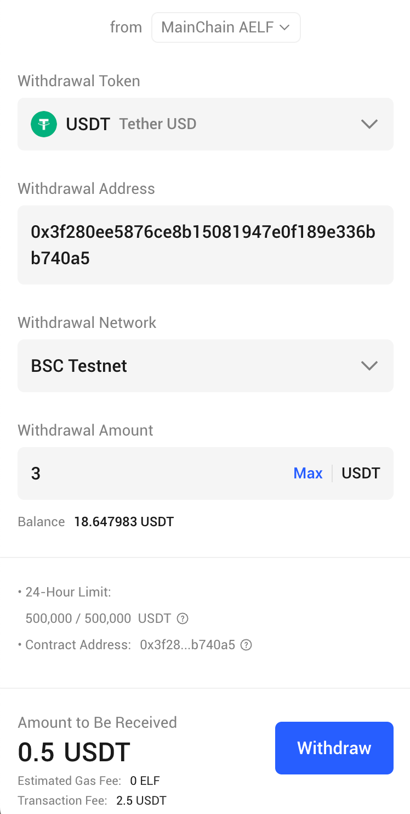

# Withdraw Comonent

Introduction

If you want to quickly access the ETransfer withdrawal function, please use this UI component. You will get the same UI display and withdrawal function as the [ETransfer app](https://app.etransfer.exchange).

### Feature

#### Withdrawal functions and UIs are as follows:

* **Select chain:** Select the aelf chain from which you will withdraw tokens.
* **Select token**: Choose the token you wish to withdraw.
* **Input address:** Enter the address where you want the tokens to be delivered.
* **Select network:** Select the network where you want the tokens to be delivered.
* **Input amount:** Enter the amount of tokens you wish to withdraw.
* **Estimated received:** After entering the above information, detailed withdrawal information will be automatically retrieved. You will see the estimated amount received, fees, and gas costs.
* **Complete the withdrawal:** Click the _Withdraw_ button and follow the prompts to authorize the withdrawal, and you can complete the withdrawal.
* **Notification:** You can see the processing transaction tip and the transaction completion notification.

<figure><figcaption><p>ComponentStyle.Mobile</p></figcaption></figure>

<figure><figcaption><p>ComponentStyle.Web</p></figcaption></figure>

<figure><figcaption><p>Processing transaction tip</p></figcaption></figure>

<figure><figcaption><p>Chrome notification</p></figcaption></figure>

<figure><figcaption><p>Transaction completion notifications</p></figcaption></figure>


## How to use

### Installation

See More: [Installation | ETransfer](../installation.md)

```bash
npm install @etransfer/ui-react
# OR
yarn add @etransfer/ui-react
```

### Config

For the `ETransferConfig`, `ETransferStyleProvider` and `ETransferWithdrawProvider` configuration used in the following examples, please refer to the [ETransfer UI SDK Config](configuration.md)

### Example

```typescript
import React from 'react';
import {
  ComponentStyle,
  Withdraw,
  ETransferConfig,
  ETransferWithdrawProvider,
  ETransferLayoutProvider
  ETransferStyleProvider,
} from '@etransfer/ui-react';
import '@etransfer/ui-react/dist/assets/index.css';

export default function ETransferLayout({ children }: { children: React.ReactNode }) {
  ETransferConfig.setConfig({
    networkType: 'MAINNET', // 'MAINNET' | 'TESTNET'
    etransferUrl: 'etransfer service url',
    etransferAuthUrl: 'etransfer authorization service url',
    etransferSocketUrl: 'etransfer socket service url',
    authorization: {
      jwt: 'Bearer xxx', // ETransfer authorization token
    },
  });

  return (
    <ETransferStyleProvider>
     <ETransferLayoutProvider>
        <ETransferWithdrawProvider>
          <Withdraw
            className={'xxx-withdraw'}
            chainClassName={'xxx-withdraw-chain'}
            fromClassName={'xxx-withdraw-from'}
            componentStyle={ComponentStyle.Mobile}
            isShowErrorTip={true}
            isShowMobilePoweredBy={false}
            isListenNoticeAuto={true}
            isShowProcessingTip={true}
            onClickProcessingTip={() => {
              // your logic
            }}
            onActionChange={(data:TWithdrawActionData) => {
              // view data
            }}
            onLogin={() => {
              // your logic
            }}
          />
        </ETransferWithdrawProvider>
      </ETransferLayoutProvider>
    </ETransferStyleProvider>
  );
}
```

#### Component properties

<table data-header-hidden><thead><tr><th width="150"></th><th width="119"></th><th width="89"></th><th></th></tr></thead><tbody><tr><td><strong>Field</strong></td><td><strong>Type</strong></td><td><strong>Required</strong></td><td><strong>Remarks</strong></td></tr><tr><td>className</td><td><code>string</code></td><td><code>false</code></td><td>The additional class to Withdraw.</td></tr><tr><td>chainClassName</td><td><code>string</code></td><td><code>false</code></td><td>The additional class to SelectChain.</td></tr><tr><td>fromClassName</td><td><code>string</code></td><td><code>false</code></td><td>The additional class to WithdrawFrom.</td></tr><tr><td>componentStyle</td><td><code>ComponentStyle</code><br></td><td><code>false</code></td><td><p>Component style configuration items.</p><p><code>ComponentStyle.Mobile</code> is a UI that is better adapted to mobile size.</p><p><code>ComponentStyle.Web</code> is a UI that is better adapted to web size.</p><p>If you want to configure responsiveness, please switch the UI style at the appropriate time.</p><p>Default is <code>ComponentStyle.Web</code></p></td></tr><tr><td>isShowErrorTip</td><td><code>boolean</code></td><td><code>false</code></td><td>Whether to automatically pop up error prompt.</td></tr><tr><td>isShowMobilePoweredBy</td><td><code>boolean</code></td><td><code>false</code></td><td>Whether to display the mobile <strong>Powered By ETransfer</strong> logo.</td></tr><tr><td>isListenNoticeAuto</td><td><code>boolean</code></td><td><code>false</code></td><td><p>Whether to establish a socket connection to listen for withdrawal transaction notifications.</p><p>The default value is <code>true</code>.</p></td></tr><tr><td>isShowProcessingTip</td><td><code>boolean</code></td><td><code>false</code></td><td><p>Whether to display a prompt for ongoing withdrawal transactions.</p><p>The default value is <code>true</code>.</p></td></tr><tr><td>onClickProcessingTip</td><td><code>()=>void</code></td><td><code>false</code></td><td>The click event for the processing transaction tip.</td></tr><tr><td>onActionChange</td><td><code>(data:TWithdrawActionData)=>void</code></td><td><code>false</code></td><td>You can retrieve the current user's operation data within this method.</td></tr><tr><td>onLogin</td><td><code>()=>void</code></td><td><code>false</code></td><td>The wallet connection event.</td></tr></tbody></table>

### Notes

* Ensure that the network configuration (`networkType`) , service URL (`etransferUrl`) , authorization URL (`etransferAuthUrl`) , socket URL (`etransferSocketUrl`) and authorization (`jwt`) are accurate.
* Use a valid JWT token to ensure proper functionality.
* To get `ETransferConfig authorization.jwt`, you can read [ETransfer SDK Auth](../auth.md)
* If you are using the message notification feature, please actively call `@etransfer/ui-react` `unsubscribeUserOrderRecord` method to cancel the WebSocket listener when logging out.

#### More Example

For more details and use cases, check out the [github example code](https://github.com/ETransferProject/etransfer-toolkit/blob/master/packages/example/src/app/withdraw/page.tsx).\


## Contact Us

For any questions, please reach out to **contact@etransfer.exchange**.\
